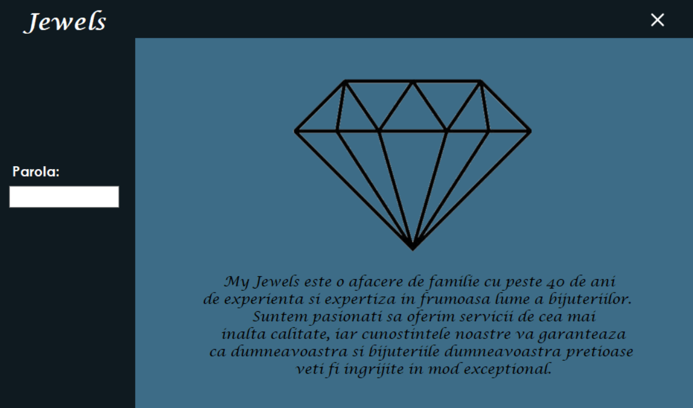
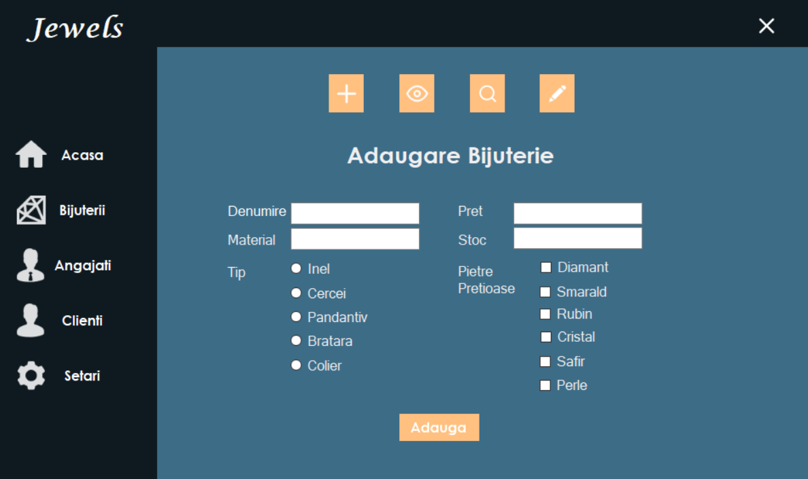
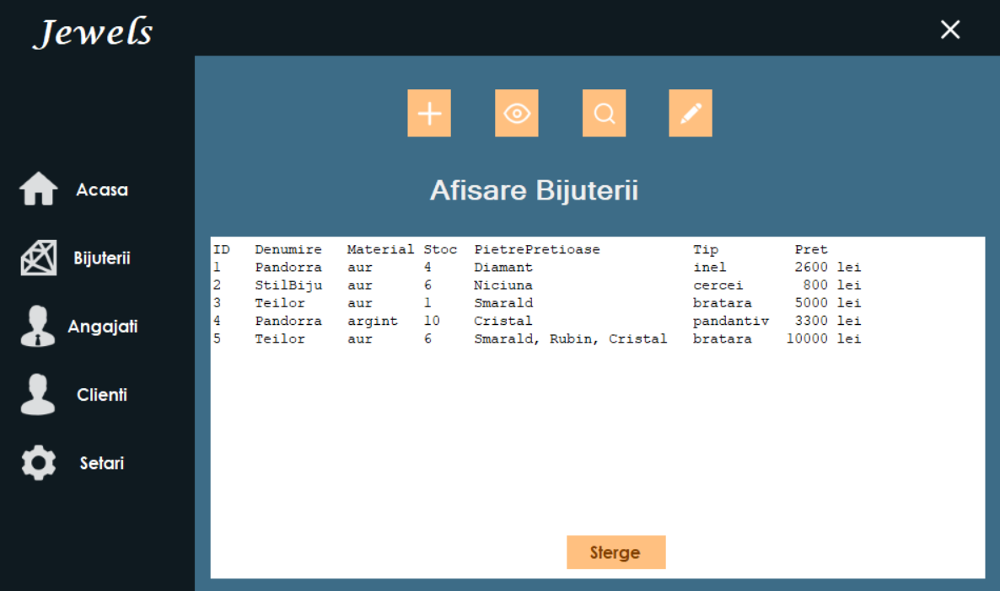
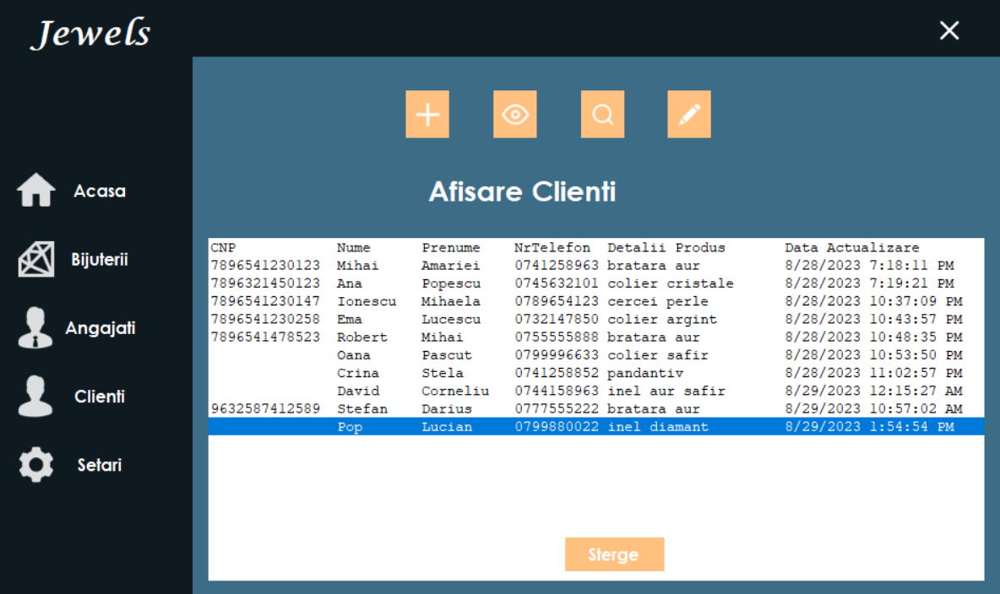
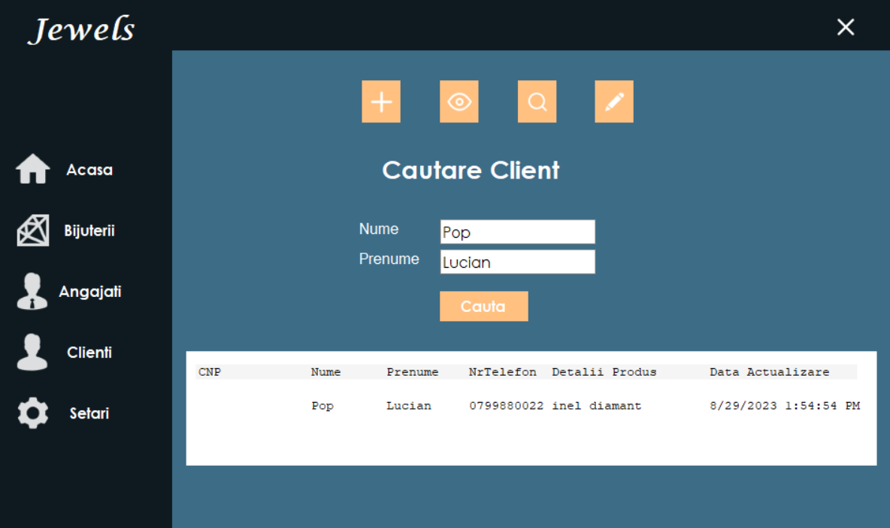
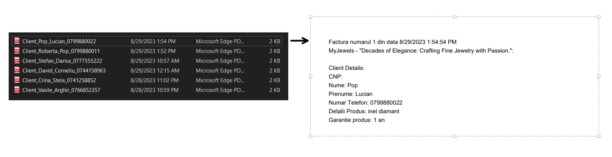

# PIU_Proiect
Aceasta aplicatie dezvoltată în C# a fost creata pentru administrarea eficientă a unui magazin de bijuterii. Cu implementarea principiilor de POO în partea de back-end și utilizarea interfețelor WindowsForms din Visual Studio 2022 pentru front-end, proiectul aduce multiple funcționalități pentru gestionarea magazinului.
 
 
Utilizatorii pot beneficia de următoarele caracteristici:
- Structură Modulară: Proiectul este structurat în trei componente principale: interfața WindowsForms și două proiecte de tip Class Library pentru gestionarea accesului la date și definirea claselor model.
- Logare Obligatorie: Accesul la aplicație necesită autentificare prin parolă. Administratorul poate modifica parola.
- Interfață Prietenoasă: Front-end-ul aplicației este dezvoltat utilizând WindowsForms, asigurând o interfață grafică intuitivă și ușor de utilizat. Imaginile folosite pentru interfata au fost descarcate de pe [https://icons8.com/](https://icons8.com/). 
- Gestionare Obiecte: Utilizatorii pot adăuga, șterge, căuta și modifica obiecte (bijuterii, angajati, clienti) în aplicatie. Acest lucru permite actualizarea rapidă și ușoară a inventarului.
- Interfețe Diferite: Aplicația oferă utilizatorului interfețe specializate pentru fiecare acțiune: adăugare, ștergere, căutare și modificare. Acest lucru facilitează navigarea și utilizarea aplicației.
- Manipularea Fișierelor: Utilizatorii au posibilitatea de a lucra cu fișiere, toate datele fiind salvate in fisiere de tip txt. Aceștia pot importa sau exporta date despre bijuterii, angajati, clienti ceea ce contribuie la gestionarea eficientă a informațiilor.
- Facturare Automată: Pentru clienți, aplicația generează automat facturi în format PDF, stocate în directorul "Bills". A fost necesara instalarea pachetului ` iTextSharp `.
 

## Interfata logare

  

## Interfata Adaugare Bijuterie

  

## Interfata Afisare Bijuterie

  

## Interfata Afisare Clienti
Deoarece campul CNP nu este obligatoriu de completat, datele necesare pentru inregistrarea unui client sunt nume, prenume, numar de telefon si detaliile produsului achizitionat.

  

## Interfata Cautare Client

  

## Director facturi

  

